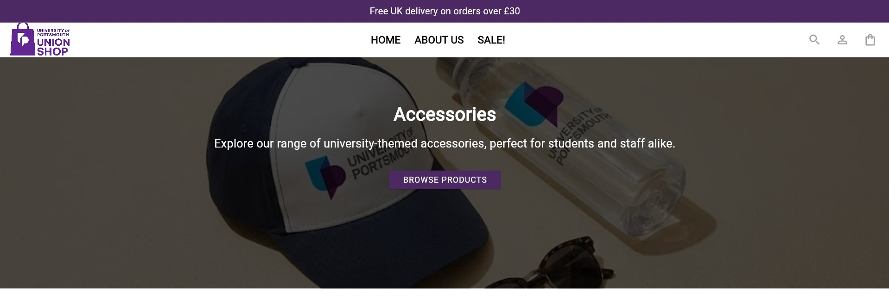
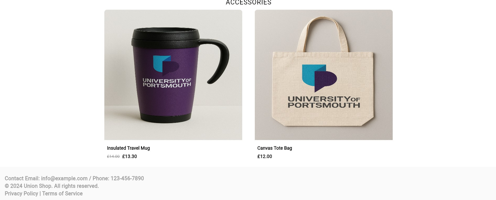
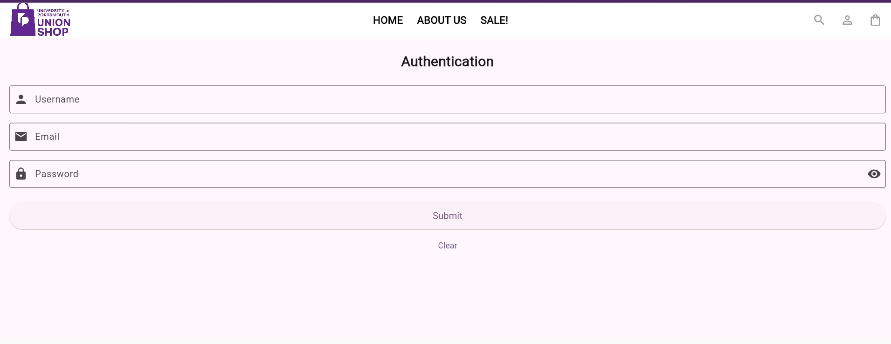
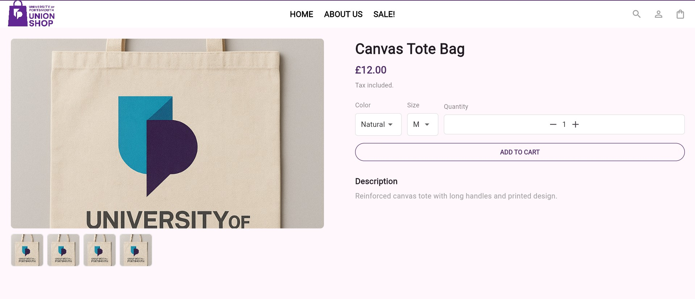
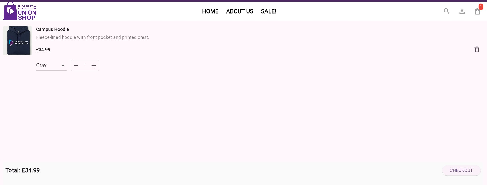
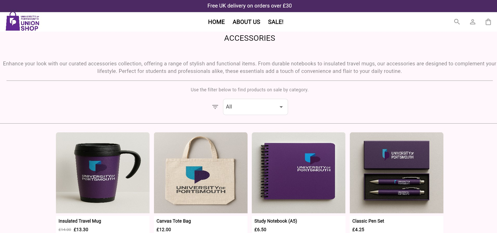
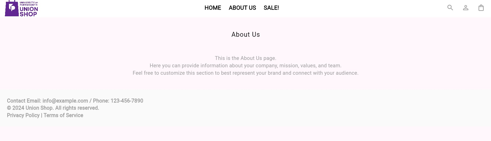

# Union Shop (Flutter)

A polished, extensible Flutter-based shop application that demonstrates a small e-commerce flow: collections, product lists, product details, cart management, and simple authentication screens. The app is structured for learning and extension and ships with local JSON assets that serve as product and collection data.

## Key Features
- Browse product collections and categories
- View product lists and product details
- Add/remove items to/from cart with local cart manager
- Simple authentication and about pages (UI stubs)
- Local JSON asset sources under `assets/data/` for easy editing
- Cross-platform support (mobile, web, desktop) via Flutter

---

## Table of Contents
- **Project**: Overview and goals
- **Installation**: Prerequisites and setup
- **Usage**: How to run and interact with the app
- **Project Structure**: Important files and folders
- **Testing**: Running unit/widget tests
- **Configuration & Data**: Editing products / collections
- **Known Issues & Roadmap**: Current limitations and planned improvements
- **Contributing**: How to help
- **Contact**: Author / maintainer info

---

## Project

Union Shop is a sample shopping application built with Flutter. It focuses on clear app architecture and local data-driven UI so you can quickly prototype features or learn Flutter app patterns.

Intended uses:
- Learning Flutter UI + state management patterns
- Small demo or prototype e-commerce UI
- Bootstrapping a real app by swapping local data for an API

---

## Installation and Setup

Prerequisites:
- Flutter SDK (stable channel, recommended >= 3.x or the current stable release)
- Dart (bundled with Flutter)
- Git
- Platform-specific toolchains depending on target platforms:
	- Android: Android SDK & Android Studio or command-line tools
	- iOS: Xcode (macOS only)
	- Windows: Visual Studio with C++ workload

Clone the repository and install dependencies:

```powershell
git clone https://github.com/Dynamite-TH/union_shop.git
cd "union_shop"
flutter pub get
```

Run the app (choose a device or platform):

```powershell
# Run on connected device or emulator
flutter run

# Run on Windows desktop
flutter run -d windows

# Run on web (Chrome)
flutter run -d chrome

# Build release for Android
flutter build apk --release
```

Notes:
- If you use an IDE (VS Code or Android Studio) open the project there for convenient device selection and hot reload.
- If your repo path contains spaces (OneDrive paths often do), quoting the path in `cd` is recommended (see example above).

---

## Usage

App flows (what to expect when using the app):
- Home page: entry with featured collections and navigation to product lists.
- Collections page: displays collection categories from `assets/data/collections.json`.
- Products page: lists products for the selected collection; source is `assets/data/products.json`.
- Product page: product details and ability to add to cart.
- Cart: view items added, update quantities, remove items (managed by `Repositories/cart_manager.dart`).
- Authentication: UI screen for login/signup flows (currently UI-only; can be wired to backend later).

Tips:
- Edit `assets/data/products.json` and `assets/data/collections.json` to add or change seed data.
- The UI reads local JSON at runtime via Flutter asset bundle — no backend required for demo.

---

## Screenshots

A few screenshots from the app (files are located in the `github_images/` folder). Use these markdown examples to embed them in the README or other docs.

- **Home (1)**



- **Home (2)**



- **Authentication**



- **Product Page**



- **Cart (with item)**



- **Empty Cart**


- **Accessories Page**



- **About Us**



Usage examples (Markdown / HTML):

- Markdown: ``
- HTML: ``

---

## Project Structure (high-level)

- `lib/` — application source code
	- `main.dart` — app entrypoint
	- `models/` — data models: `products.dart`, `collections.dart`
	- `Repositories/` — data/repository layer: `union_shop_repository.dart`, `cart_manager.dart`
	- `views/` — UI screens and pages
		- `home_page.dart`, `collections.dart`, `products_page.dart`, `product_page.dart`, `cart.dart`, `authentication.dart`, `about_us.dart`, `not_found.dart`
		- `widgets/` — reusable UI components
- `assets/` — static app assets
	- `data/` — `products.json`, `collections.json` (seed data you can edit)
	- `images/` — product & collection images (referenced by product data)
- `test/` — unit and widget tests

Build outputs and platform folders created by Flutter runtime are in `build/`, `ios/`, `android/`, `windows/`, `macos/`, `linux/`.

Key files:
- `lib/Repositories/union_shop_repository.dart` — data provider (reads assets / can be adapted to network)
- `lib/Repositories/cart_manager.dart` — cart state management used by cart UI and product pages

---

## Configuration & Data

Editing local seed data:
- `assets/data/products.json`: product list. Each product should include ID, title, description, price, image path, and collection ID.
- `assets/data/collections.json`: collection metadata used by the collections screen.

When adding images, place them under `assets/images/products/` or `assets/images/collections/` and reference the path in JSON. Remember to update `pubspec.yaml` if you add new asset directories.

Switching to a real backend:
- Replace or extend `union_shop_repository.dart` to fetch data from an API and update models accordingly.

---

## Testing

Run unit and widget tests with:

```powershell
flutter test
```

Project already contains test helpers and folder structure under `test/`. Add tests under `test/models`, `test/repositories`, or `test/views` as needed.

---

## Known Issues & Limitations

- Data is local only (JSON assets); no network backend implemented.
- Authentication screen is a UI stub — there is no real auth service by default.
- Cross-platform packaging requires platform-specific toolchains (e.g., Visual Studio for Windows). See Flutter docs if build fails.
- If project path is on OneDrive or other cloud-synced folders, file locks or path syncing can occasionally interfere with hot reload; consider using a local development folder if you see odd file system behavior.

Planned improvements:
- Add remote API + offline caching
- Add persistent cart storage (SQLite / shared preferences)
- Improve accessibility and automated tests
- Add CI workflow for automated tests and builds

---

## Contributing

Contributions are welcome. Suggested workflow:

1. Fork the repository
2. Create a feature branch: `git checkout -b feature/short-description`
3. Make changes and add tests
4. Run `flutter test` and ensure everything passes
5. Push and open a Pull Request

Coding style:
- Prefer clear, descriptive names for widgets and methods
- Keep UI logic in widgets and business logic in repositories or managers

Issue reporting:
- Open an issue with steps to reproduce, platform, Flutter version, and logs if available.

---

## Quick Developer Notes

- Update dependencies: `flutter pub upgrade`
- Format Dart code: `dart format .` or use your editor's formatter
- Run analyzer: `flutter analyze`

---

## Contact

Maintainer: Dynamite-TH

If you have questions or want to collaborate, open an issue or a pull request on the repository.

---